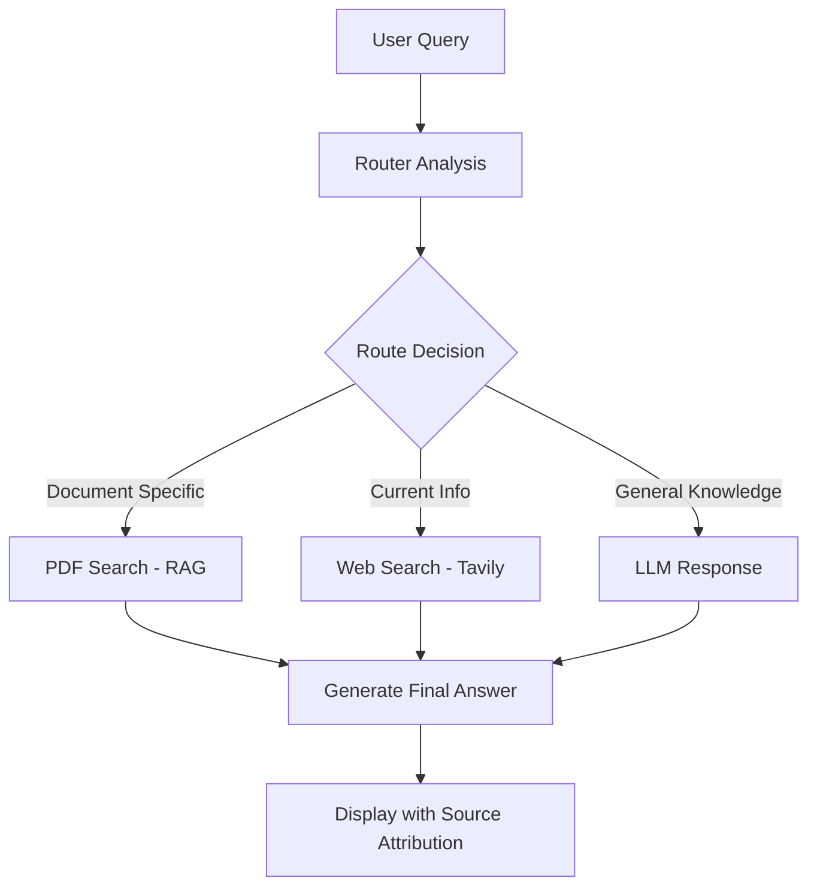

# 🤖 Agentic PDF Chat System

An intelligent document chat system that uses **LangGraph** for orchestration and smart routing between PDF content (RAG), web search, and LLM knowledge.


## 🌟 Features

- **📄 PDF Upload & Processing**: Upload PDF files and create searchable vector embeddings
- **🧠 Intelligent Query Routing**: Uses LangGraph conditional edges to route queries optimally
- **🔍 RAG Implementation**: Semantic search through PDF content using FAISS and HuggingFace embeddings
- **🌐 Web Search Integration**: Real-time information retrieval via Tavily API
- **⚡ Fast LLM Inference**: Powered by Groq's high-speed language models
- **📊 Source Attribution**: Clear indication of answer sources (PDF/Web/LLM Knowledge)
- **💬 Interactive Chat Interface**: Clean Streamlit UI with conversation history
- **🎯 Smart Fallbacks**: Seamless switching between information sources

## 🏗️ Architecture

The system uses a sophisticated **LangGraph workflow** with conditional routing:



### Routing Intelligence
- **PDF Route**: Document-specific questions, content references
- **Web Route**: Current events, recent information, time-sensitive queries
- **LLM Route**: General knowledge, conceptual questions

## 🚀 Quick Start

### Prerequisites
- Python 3.8+
- Groq API Key ([Get here](https://console.groq.com/))
- Tavily API Key ([Get here](https://tavily.com/))

### Installation

1. **Clone the repository**
   ```bash
   git clone https://github.com/yourusername/agentic-pdf-chat.git
   cd agentic-pdf-chat
   ```

2. **Install dependencies**
   ```bash
   pip install -r requirements.txt
   ```

3. **Run the application**
   ```bash
   streamlit run app.py
   ```

4. **Configure API Keys**
   - Enter your Groq API key in the sidebar
   - Enter your Tavily API key in the sidebar

5. **Start Chatting!**
   - Upload a PDF (optional)
   - Ask questions and watch the intelligent routing in action

## 📋 Usage Examples

### PDF-Specific Queries
```
"What are the main conclusions in this document?"
"Summarize the methodology section"
"What does the paper say about machine learning?"
```

### Web Search Queries
```
"What's the latest news about AI developments?"
"Current stock price of Tesla"
"Recent breakthroughs in quantum computing"
```

### General Knowledge Queries
```
"Explain the concept of neural networks"
"How does photosynthesis work?"
"What is the theory of relativity?"
```

## 🛠️ Technology Stack

| Component | Technology | Purpose |
|-----------|------------|---------|
| **Orchestration** | LangGraph | Workflow management and conditional routing |
| **UI Framework** | Streamlit | Interactive web interface |
| **LLM** | Groq (Llama 3 70B) | Fast language model inference |
| **Embeddings** | HuggingFace Transformers | Semantic text embeddings |
| **Vector Store** | FAISS | Efficient similarity search |
| **Web Search** | Tavily API | Real-time information retrieval |
| **PDF Processing** | PyPDF | Document loading and parsing |

## ⚙️ Configuration

### Model Configuration
```python
# In app.py - modify these constants
EMBEDDING_MODEL = "sentence-transformers/all-MiniLM-L6-v2"
GROQ_MODEL = "llama3-70b-8192"
```

### Chunking Strategy
```python
# Text splitting parameters
chunk_size = 1000
chunk_overlap = 200
```

### Search Parameters
```python
# Vector search
similarity_search_k = 3

# Web search
max_results = 3
search_depth = "basic"
```

## 📁 Project Structure

```
agentic-pdf-chat/
├── app.py                 # Main Streamlit application
├── requirements.txt       # Python dependencies
├── README.md             # This file
└── .gitignore           # Git ignore rules
```

## 🔧 Advanced Features

### Custom Routing Logic
The system analyzes queries using LLM-powered routing:
- **Intent Recognition**: Understands user intent from natural language
- **Context Awareness**: Considers available PDF content
- **Keyword Detection**: Identifies temporal and domain-specific markers

### Error Handling
- API key validation
- PDF processing error recovery
- Network timeout handling
- Graceful fallbacks between sources

### Performance Optimizations
- Efficient vector storage with FAISS
- Chunked document processing
- Cached embeddings
- Optimized search parameters

## 🤝 Contributing

Contributions are welcome! Here are some ways you can help:

1. **Fork the repository**
2. **Create a feature branch** (`git checkout -b feature/amazing-feature`)
3. **Commit your changes** (`git commit -m 'Add amazing feature'`)
4. **Push to the branch** (`git push origin feature/amazing-feature`)
5. **Open a Pull Request**


## 🐛 Troubleshooting

### Common Issues

**API Key Errors**
```
Solution: Verify your Groq and Tavily API keys are valid and have sufficient credits
```

**PDF Upload Fails**
```
Solution: Ensure PDF is not corrupted and under 50MB. Try a different PDF file.
```

**Slow Performance**
```
Solution: Consider using smaller PDFs or upgrading system memory
```

**Network Errors**
```
Solution: Check internet connection for web search functionality
```

## 🙏 Acknowledgments

- **LangGraph** for orchestration framework
- **Streamlit** for the amazing UI framework
- **Groq** for fast LLM inference
- **HuggingFace** for embeddings and transformers
- **Tavily** for web search capabilities
- **FAISS** for efficient vector search

## 📞 Support

If you encounter any issues or have questions:

1. Check the [Issues](https://github.com/yourusername/agentic-pdf-chat/issues) page
2. Create a new issue with detailed description
3. Join our discussions for feature requests


---

⭐ **Star this repository if you found it helpful!**

Made with ❤️ by [Arshjit Singh](https://github.com/arshjitsingh224)
